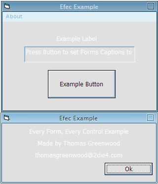



## Each Form Each Control Example

### Description

This code enables you to quickly edit a property on every form, every controls, or selected forms and controls. Shows how to simply handle the errors of a Each Control loop and shows an example of the TypeOf function to reduce errors.

Well Documentated and help available through

thomasgreenwood~2die4.com (~ = @)
 
### More Info
 
If not coded correctly errors can be returned.

Forms return to normal once unloaded - solution is to run the process run on the form before you load or show it.

             |
---                |---
**Submitted On**   |2003-12-12 15:31:02
**By**             |[Thomas Greenwood](https://github.com/Planet-Source-Code/PSCIndex/blob/master/ByAuthor/thomas-greenwood.md)
**Level**          |Beginner
**User Rating**    |4.0 (8 globes from 2 users)
**Compatibility**  |VB 5\.0, VB 6\.0
**Category**       |[Custom Controls/ Forms/  Menus](https://github.com/Planet-Source-Code/PSCIndex/blob/master/ByCategory/custom-controls-forms-menus__1-4.md)
**World**          |[Visual Basic](https://github.com/Planet-Source-Code/PSCIndex/blob/master/ByWorld/visual-basic.md)
**Archive File**   |[Each\_Form\_16831012122003\.zip](https://github.com/Planet-Source-Code/thomas-greenwood-each-form-each-control-example__1-50425/archive/master.zip)

